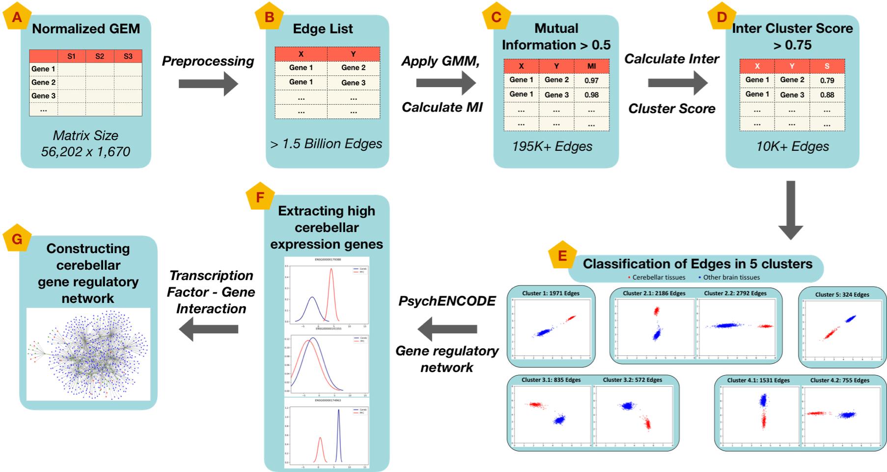

# NetExtractor

USAGE:

1) Pre-processing

Pre-processing includes normalizing of the data. Details can be found within the NetExtractor paper, and the normalizing code can be accessed at: https://github.com/SystemsGenetics/GEMprep

2) NetExtractor

python NetExtractor.py

This code reads in the GEM (GTEx_v7_brain_subGEM-log-no.txt) and outputs a file with with GeneA_name, GeneB_name, MI value, Inter-cluster score value.
